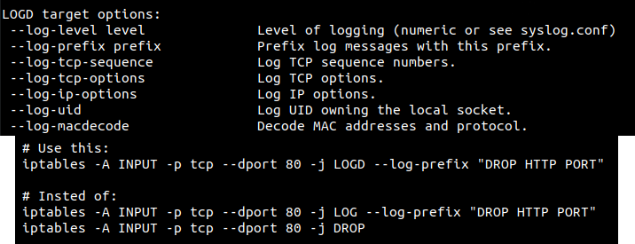

<h1 align="center">xtables-log-and-drop (xt_LOGD)</h1>

## Overview

The xtables-log-and-drop is an extension module for the Linux kernel's netfilter framework, designed to enhance packet filtering capabilities. 

This package provides functionality similar to iptables LOG, allowing you to log packets, but with an additional feature to drop the logged packets instead of continuing to go with the netfilter flow.

This module has the same options as default LOG target, and was developed to minize the number of rules needed to log and drop packets with diferents log prefixes.



### Features

- **Drop Action**: In addition to logging, this module allows you to drop packets that match specified criteria. This provides an option by preventing certain types of traffic from reaching their destination and  save the logs at same time.

- **Efficient Resource Utilization**: The xtables-log-and-drop is designed to be resource-efficient, ensuring minimal impact on system performance while providing robust packet logging and filtering capabilities.

## Installation

```sh
# Install needed packages
apt update
apt install -y linux-headers-$(uname -r)
apt install -y libxtables-dev
apt install -y module-assistant iptables-dev pkg-config

# Compile the module
cd src
./configure
make all install

# Load the module in Kernel
insmod xt_LOGD.ko
```

### Security

If you discover any security related issues, please email murilo.chianfa@outlook.com instead of using the issue tracker.

## Credits

- [Murilo Chianfa](https://github.com/MuriloChianfa)
- [All Contributors](../../contributors)

## License

The MIT License (MIT). Please see [License File](LICENSE.md) for more information.
